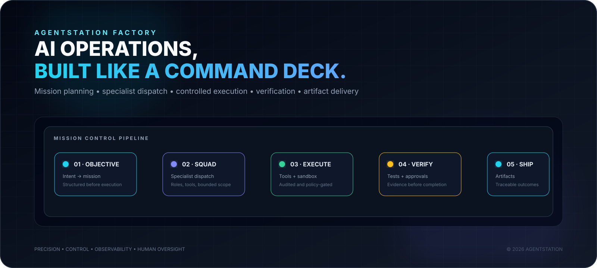

<div align="center">



# AgentStation Factory

### Autonomous AI Operations Command Center

**Turn objectives into controlled missions. Coordinate specialist agents. Execute real tools. Verify outcomes. Deliver traceable artifacts.**

<p>
<a href="https://github.com/Olori24/AgentStation-Factory/actions"></a>


</p>

<p>


</p>

**Precision · Control · Observability · Human Oversight**

</div>

---

## ⚡ What is AgentStation?

AgentStation Factory is an **AI operations platform** built around a simple idea:

> **AI should not stop at generating an answer. It should move an objective through planning, tools, execution, verification and delivery.**

Instead of treating an agent as a chat window, AgentStation treats AI as a **digital workforce operating inside a controlled command environment**.

The product is designed to feel like stepping onto the bridge of a powerful AI operations system:

**Precise. Alive. Intelligent. Controlled.**

---

## 🛰️ The Mission Loop

```
┌──────────────────┐
│   HUMAN INTENT   │
│ Objective / Goal │
└────────┬─────────┘
         ▼
┌──────────────────┐
│  MISSION CONTROL │
│ Plan → State     │
└────────┬─────────┘
         ▼
┌──────────────────┐
│ SPECIALIST SQUAD │
│ Roles + Context  │
└────────┬─────────┘
         ▼
┌──────────────────┐
│ CONTROLLED TOOLS │
│ Web / Files / QA │
└────────┬─────────┘
         ▼
┌──────────────────┐
│ EXECUTION LAYER  │
│ Sandbox + Stream │
└────────┬─────────┘
         ▼
┌──────────────────┐
│   VERIFICATION   │
│ Tests + Approval │
└────────┬─────────┘
         ▼
┌──────────────────┐
│ ARTIFACT DELIVERY│
│ Code / Reports   │
└──────────────────┘
```

Every stage has an operational boundary. The objective is not simply to make agents powerful.

**The objective is to make agent power observable, bounded and controllable.**

---

## 🎛️ Command Deck

The interface follows a premium, cinematic operations model rather than a generic SaaS dashboard.

### Command
- Command Center
- Agents
- Missions
- Executions

### Build
- Agent Factory
- Templates
- Integrations

### Operate
- Activity
- Approvals
- Monitoring

### System
- Analytics
- Settings
- Security

### Experience principles

- **Jakob's Law:** familiar navigation and interaction patterns.
- **Operational clarity:** state is visible without decorative noise.
- **Cinematic depth:** hierarchy, motion and ambient feedback communicate system state.
- **Trust layer:** who, what, when, why and result.
- **Mobile-first:** responsive command surfaces and installable PWA experience.
- **Reduced motion:** respect user accessibility preferences.
- **Truthful status:** disabled capabilities are shown as disabled, never simulated as live.

---

## 🤖 Specialist Fleet

| Specialist | Mission role |
|---|---|
| **Atlas** | Architecture, decomposition and technical strategy |
| **Cypher** | Full-stack engineering and implementation |
| **Sentinel** | QA, testing and verification |
| **Vesper** | Research synthesis and executive documentation |
| **Nova** | Motion, presentation and creative production |
| **Hermes** | Market and technology intelligence |
| **Nexus** | Data analysis and spreadsheet workflows |
| **Sterling** | Business operations and outreach |
| **Aegis** | Operations, compliance and final delivery |

> Exact provider/model selection is configuration-dependent. The fleet represents the product's specialist-role architecture.

---

## 🛠️ Tooling Philosophy

AgentStation treats tools as **controlled capabilities**, not unrestricted superpowers.

Representative operations:

```
web_search       web_fetch
file_read        file_write
file_patch       file_list
code_execute     test_runner
document_generate
artifact_bundle
```

Risk is deliberately layered:

```
LOW
  Inspect / read / research
       ↓
MEDIUM
  Write / patch / test
       ↓
HIGH
  Destructive or privileged operations
       ↓
HUMAN APPROVAL
       ↓
ALLOW  /  DENY
```

This model is reflected in server-side authorization, approval gates, bounded inputs, audit records and sandbox controls.

---

## 🔐 Security Posture

Security is part of the architecture.

### Hardened controls

- Signed, expiring sessions
- HttpOnly + Secure + SameSite cookie protection
- Server-side role authorization
- Object/mission access checks
- Bounded request and command sizes
- Workspace traversal protection
- Symlink escape detection
- Recursive audit redaction
- SSRF and DNS-rebinding defenses
- Authenticated WebSocket upgrades
- Terminal/sandbox fail-closed controls
- Docker isolation requirements for production execution
- No-network sandbox mode
- Dropped capabilities and no-new-privileges
- Non-root execution and resource limits
- Gitleaks secret scanning
- High-severity dependency audit
- Static security regression tests
- CSP and hardened response headers

### Evidence

The detailed security register is maintained in:

**[Security Audit](./docs/SECURITY_AUDIT_2026-10-05.md)**

Security language is intentionally evidence-based. **Hardening does not automatically equal production certification.**

---

## 🗄️ Persistence & Runtime

The remediation architecture uses a **PostgreSQL compatibility bridge backed by Neon** for durable AgentStation state, with production configured to fail closed when required persistence configuration is unavailable.

Runtime-sensitive capabilities remain explicit:

| Capability | Policy |
|---|---|
| PostgreSQL persistence | Required in production |
| Session secret | Required |
| Encryption key | Required |
| Bootstrap credential | Required |
| Autonomous runtime | Explicitly enabled |
| Terminal execution | Explicitly enabled |
| Docker sandbox | Required before production execution |
| Multi-instance JSONB concurrency | Not certified |

This separation prevents the UI from claiming infrastructure capabilities that have not actually been verified.

---

## 📱 Installable PWA

AgentStation includes a lightweight PWA layer for the web experience.

**Included:**
- Web App Manifest
- Standalone display mode
- Android/mobile metadata
- iOS home-screen metadata
- Service-worker registration
- App-shell offline fallback
- Static asset caching
- API and WebSocket cache exclusion
- Cache versioning and cleanup

### Intended flow

```
Vercel URL
   ↓
Open AgentStation
   ↓
Install / Add to Home Screen
   ↓
AgentStation launches as an app
```

The PWA does **not** fake offline backend functionality. Authenticated APIs, missions, WebSockets and server execution remain network-dependent.

---

## 🧰 Technology Stack

| Layer | Technology |
|---|---|
| Frontend | React 19 + TypeScript |
| Build | Vite 6 + esbuild |
| Styling | Tailwind CSS + custom cinematic CSS |
| Motion | Motion |
| Icons | Lucide React |
| Backend | Node.js + Express |
| Real-time | WebSocket + SSE |
| AI | Google GenAI integration |
| Database | PostgreSQL / Neon |
| Testing | TypeScript + Python verification |
| Security | CSP + auth/RBAC + sandbox controls |
| Delivery | Vercel-compatible frontend + Render runtime configuration |
| App mode | PWA / Service Worker |

---

## 🧪 Verification Pipeline

The repository CI is intentionally broader than "does it compile?"

```
DEPENDENCIES
     ↓
npm audit
     ↓
SECRET SCAN
     ↓
TYPE CHECK
     ↓
PRODUCTION BUILD
     ↓
STATIC SECURITY AUDIT
     ↓
TEST SUITE
     ↓
EVIDENCE
```

The workflow verifies dependency safety, secret history, TypeScript, production compilation, security regressions and automated tests.

---

## 🚀 Quick Start

### Requirements

- Node.js 22+
- npm
- PostgreSQL/Neon for production persistence
- Provider credentials for capabilities you intend to enable

### Install

```bash
git clone https://github.com/Olori24/AgentStation-Factory.git
cd AgentStation-Factory
npm ci
cp .env.example .env
```

### Development

```bash
npm run dev
```

### Type check

```bash
npm run lint
```

### Build

```bash
npm run build
```

### Production

```bash
npm run start
```

### Database migration

```bash
npm run db:migrate
```

**Never commit secrets to the repository.**

---

## 📂 Repository Architecture

```
AgentStation-Factory/
│
├── .github/workflows/       # CI + security verification
├── db/migrations/           # PostgreSQL migrations
├── docs/
│   ├── assets/              # Product / README SVG artwork
│   ├── PREMIUM_UI_UX_CINEMATIC_SPEC.md
│   └── SECURITY_AUDIT_2026-10-05.md
├── public/
│   ├── manifest.webmanifest # PWA manifest
│   ├── sw.js                # Service worker
│   ├── icon.svg
│   └── favicon.svg
├── scripts/
│   └── migrate.mjs          # Transactional migration runner
├── server/
│   ├── orchestrator/        # Mission planning / execution
│   ├── tools/               # Tool registry + security boundaries
│   ├── auth.ts              # Authentication
│   ├── db.ts                # Durable state layer
│   ├── sandbox.ts            # Sandboxed execution
│   └── terminalWs.ts         # Terminal WebSocket
├── src/
│   ├── components/          # Command-deck UI
│   ├── services/            # Client orchestration
│   ├── data/                # Agent / mission definitions
│   ├── App.tsx
│   ├── index.css            # Premium visual system
│   └── main.tsx             # App entry + PWA registration
├── render.yaml
├── vercel.json
├── package.json
└── README.md
```

---

## 📊 Engineering Maturity

| Surface | Evidence state |
|---|---|
| Command-deck UI | 🟢 Implemented |
| Mission workflow | 🟢 Implemented |
| Specialist fleet | 🟢 Implemented |
| Auth + RBAC | 🟢 Hardened |
| Tool boundaries | 🟢 Hardened |
| PostgreSQL persistence bridge | 🟢 Implemented |
| PWA shell | 🟢 Implemented |
| CI security verification | 🟢 Tested |
| Production sandbox isolation | 🟡 Runtime certification required |
| Full relational tenant decomposition | 🟡 Hardening / roadmap |
| Distributed rate limiting | 🟡 Roadmap |
| Production certification | 🔴 Not claimed |

**Green means shipped/tested. Yellow means remaining engineering or runtime work. Red means deliberately not certified.**

---

## 🗺️ Roadmap

- Deeper relational multi-tenant persistence
- Production-grade artifact/object storage
- Distributed rate limiting
- Certified isolated execution runtimes
- Expanded integrations
- Richer monitoring and analytics
- Autonomous recurring objectives with bounded controls
- Stronger agent evaluation and reliability telemetry
- More powerful mission templates
- Deeper memory and state management

Roadmap items are not presented as shipped capabilities until implemented and verified.

---

## 🤝 Contributing

AgentStation is built around a few non-negotiables:

**Security before convenience.  
Evidence before claims.  
Server-side authorization.  
Observable execution.  
Explicit operational boundaries.  
Tests for meaningful behavior.  
Intentional UX.**

Create a branch, make the change, run the verification suite, and open a pull request with:

- what changed
- why it changed
- security implications
- tests performed
- deployment/runtime implications

---

## 📜 License

MIT. See [LICENSE](./LICENSE).

---

<div align="center">

## AgentStation Factory

**Build agents. Run missions. Verify outcomes. Ship with control.**

<sub>Engineered for autonomous AI operations · 2026</sub>

</div>
